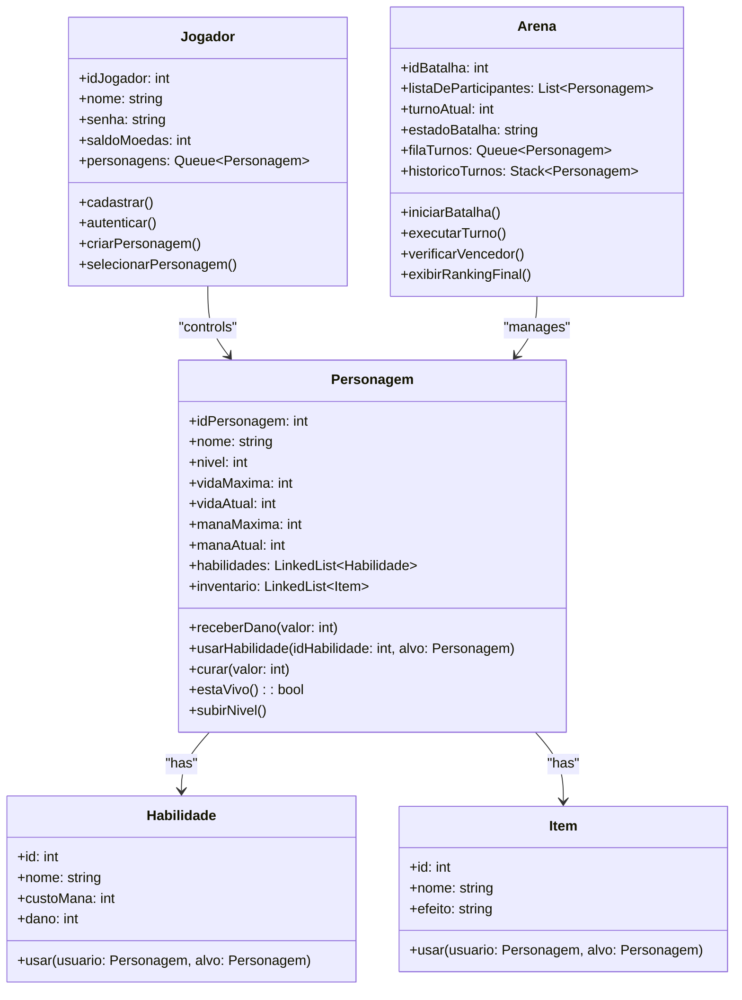

```mermaid
classDiagram
    class Jogador {
        +idJogador: int
        +nome: string
        +senha: string
        +saldoMoedas: int
        +personagens: Queue~Personagem~
        +cadastrar()
        +autenticar()
        +criarPersonagem()
        +selecionarPersonagem()
    }
    class Personagem {
        +idPersonagem: int
        +nome: string
        +nivel: int
        +vidaMaxima: int
        +vidaAtual: int
        +manaMaxima: int
        +manaAtual: int
        +habilidades: LinkedList~Habilidade~
        +inventario: LinkedList~Item~
        +receberDano(valor: int)
        +usarHabilidade(idHabilidade: int, alvo: Personagem)
        +curar(valor: int)
        +estaVivo(): bool
        +subirNivel()
    }
    class Arena {
        +idBatalha: int
        +listaDeParticipantes: List~Personagem~
        +turnoAtual: int
        +estadoBatalha: string
        +filaTurnos: Queue~Personagem~
        +historicoTurnos: Stack~Personagem~
        +iniciarBatalha()
        +executarTurno()
        +verificarVencedor()
        +exibirRankingFinal()
    }
    class Habilidade {
        +id: int
        +nome: string
        +custoMana: int
        +dano: int
        +usar(usuario: Personagem, alvo: Personagem)
    }
    class Item {
        +id: int
        +nome: string
        +efeito: string
        +usar(usuario: Personagem, alvo: Personagem)
    }

    Jogador --> Personagem : "controls"
    Personagem --> Habilidade : "has"
    Personagem --> Item : "has"
    Arena --> Personagem : "manages"
```