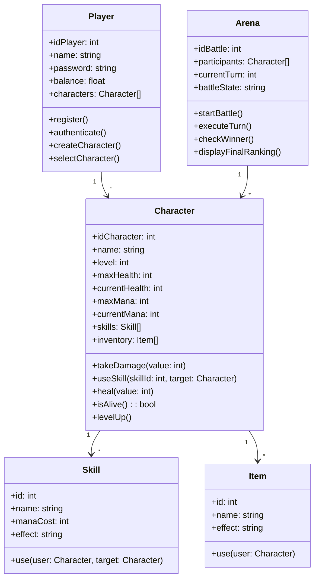

```mermaid
classDiagram
    class Player {
        +idPlayer: int
        +name: string
        +password: string
        +balance: float
        +characters: Character[]
        +register()
        +authenticate()
        +createCharacter()
        +selectCharacter()
    }
    class Character {
        +idCharacter: int
        +name: string
        +level: int
        +maxHealth: int
        +currentHealth: int
        +maxMana: int
        +currentMana: int
        +skills: Skill[]
        +inventory: Item[]
        +takeDamage(value: int)
        +useSkill(skillId: int, target: Character)
        +heal(value: int)
        +isAlive(): bool
        +levelUp()
    }
    class Arena {
        +idBattle: int
        +participants: Character[]
        +currentTurn: int
        +battleState: string
        +startBattle()
        +executeTurn()
        +checkWinner()
        +displayFinalRanking()
    }
    class Skill {
        +id: int
        +name: string
        +manaCost: int
        +effect: string
        +use(user: Character, target: Character)
    }
    class Item {
        +id: int
        +name: string
        +effect: string
        +use(user: Character)
    }

    Player "1" --> "*" Character
    Character "1" --> "*" Skill
    Character "1" --> "*" Item
    Arena "1" --> "*" Character
```
